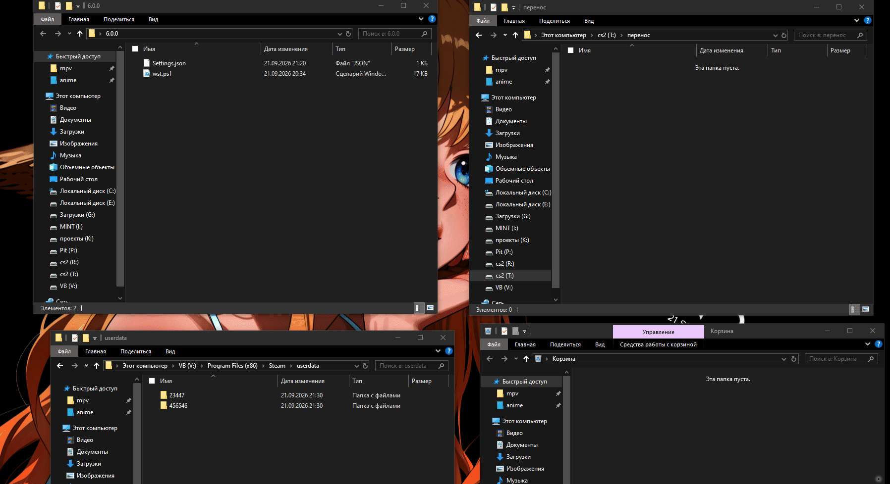

# wst

## безлопастная чистка данных профиля стим
основных папок Steam управлением над профилями:
`appcache`,
`config`,
`depotcache`,
`dumps`,
`friends`,
`logs`.
### Перед запуском обязательно отредактируйте любым текстовым редактором, файл `wst`:
Можно менять, удалять эти папки на ваше усмотрение, которые представлены ниже.
Основные папки для очистки:

`appcache`,
`config`,
`depotcache`,
`dumps`,
`friends`,
`logs`.

```PowerShell
$cleanupFolderNames = @(
    "appcache",
    "config",
    "depotcache",
    "dumps",
    "friends",
    "logs"
)
```

#### Важно
- Закройте Steam перед запуском
- Убедитесь, что пути указаны верно
- Папка с `userdata` — это ваши аккаунты или подругому тут храняться настройки всех игр, настройки стим для данного пользователя, бывают и сохранения сессий.

### Примичание
- Если у вас не скачивается файл, то выберите скопировать через формат `raw.file` [raw](https://raw.githubusercontent.com/BinAlexme/wst/refs/heads/master/wst.ps1)
- вставьте в текстовый редактор и выбрите в кодировке `UTF-8 c BOM`, если у вас кириллица не коректно отображается
- Сохраните как и обязательно расширение файла `.ps1`.
#### Запуск скрипта
1. Запустите скрипт `wst.ps1` ПКМ по нему и выполнить с помощью PowerShell
2. Вас приветствует скрипт на первом этапе, показывает что находится в папке `userdata`, которую он самостоятельно найдет.
3. На третьем этапе вам будут доступны 3 пункта на выбор:
- `1` — очистка папок
- `2` — очистка + с userdata:
    - запрос на удаление
    - перенос профиля
        - потребует вас задать путь переноса в первый раз. на повторный запуск будет сохранение пути. 
- `3` — дополнительно, меняет имя папки на дату  



### Пример
Для примера сделал на своей основе дисков. У вас порядок может отличаться.
У меня стим установлен на диске `V:`: что видно на видео, как происходит процессе видео.
- Есть 3 режима работы скрипта.
    предлагается:
    - чистка
    - перенос
    - сохранение папки датой (версии)
Обязательная чистка временных файлов как в певом пункте скрипта.
На примере используется путь переноса данных `userdata` в `K:\\перенос`
